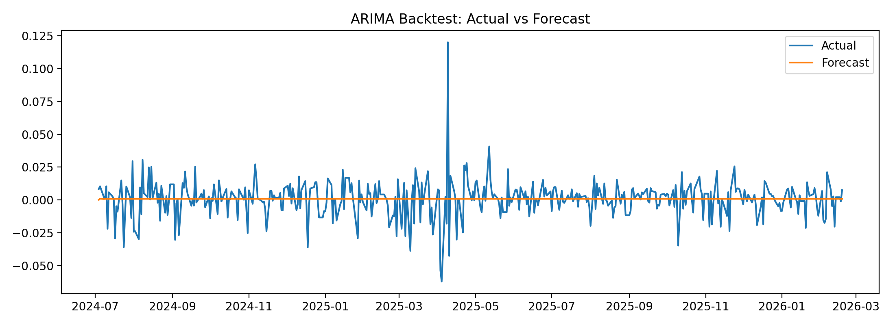
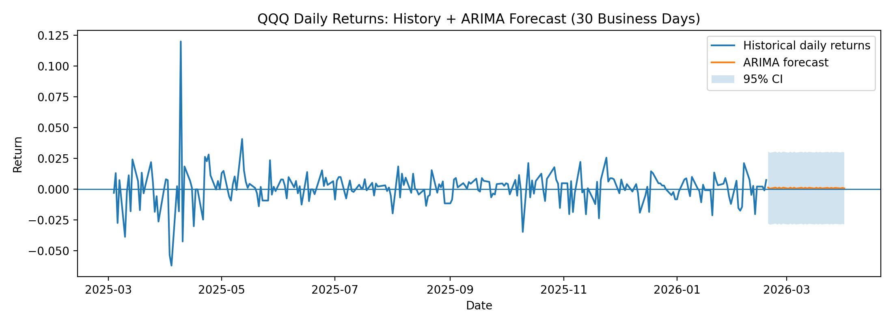
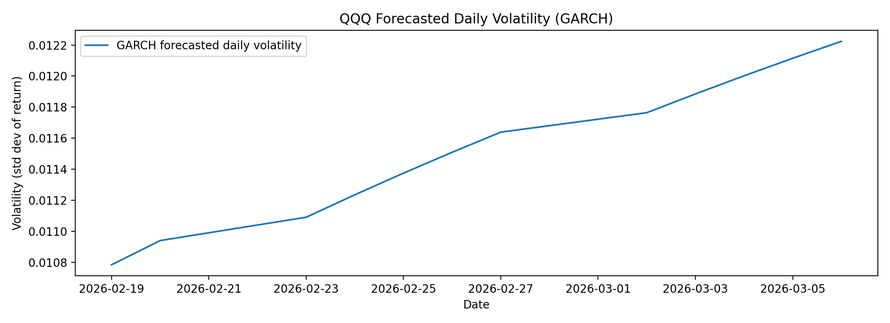

# Margin & Returns Forecasting

This project builds a forward-looking analytics framework to forecast financial returns, model volatility, and simulate margin stability using time series methods.

The goal is to move beyond simple prediction and toward **decision-grade insight** by combining:

- Return forecasting (ARIMA)
- Structural trend modeling (Prophet)
- Volatility modeling (GARCH)

---

## Project Overview

This repository demonstrates how financial performance can be modeled through:

| Model | Purpose |
|-------|--------|
| ARIMA | Short-term return forecasting |
| Prophet | Long-term structural trend forecasting |
| GARCH | Volatility / risk modeling |

Together, these components provide a more realistic view of future performance by capturing:

- Expected returns  
- Uncertainty  
- Instability

---

## Key Capabilities

- Time series forecasting of asset returns
- Volatility modeling using GARCH
- Margin trend simulation
- Out-of-sample backtesting
- Confidence interval visualization

---

## Example Outputs

The notebooks generate:

- ARIMA return forecasts
- Backtested performance vs actual values
- Volatility forecasts (risk outlook)
- Margin trend projections

---

## Project Structure
```text
margin-returns-forecasting/
│
├── src/
│   ├── data_prep.py
│   ├── arima_model.py
│   ├── prophet_model.py
│   └── volatility_model.py
│
├── notebooks/
│   ├── margin_forecast.ipynb
│   └── returns_forecast.ipynb
│
├── data/
├── outputs/
├── requirements.txt
└── README.md
```
---

## Sample Outputs

### ARIMA Backtest (Actual vs Forecast)



---

### Future Return Forecast (Next 30 Business Days)



---

### Volatility Forecast (GARCH)



---


